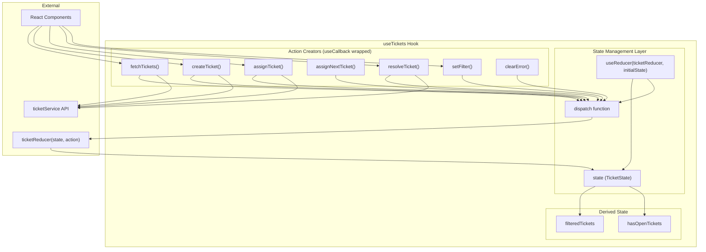
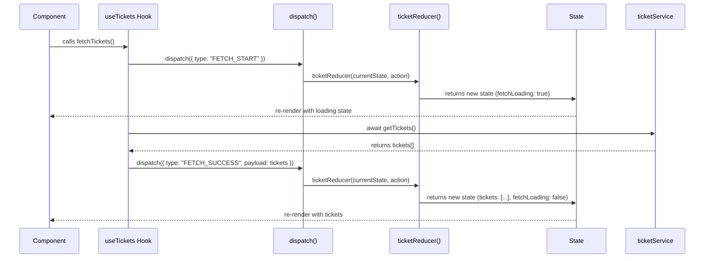
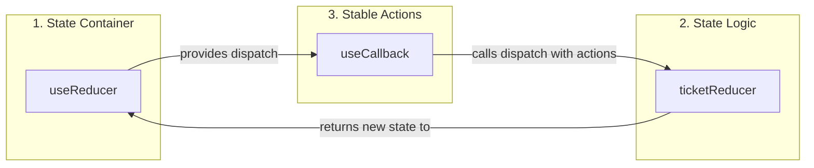

# useTickets Hook - Mental Model

## Overview

The `useTickets` hook manages all ticket-related state and operations using React's `useReducer` pattern combined with `useCallback` for performance optimization.

## Architecture Diagram



## Core Line Explanation

```typescript
const [state, dispatch] = useReducer(ticketReducer, initialState);
```

This line establishes the entire state management system:

| Part | What It Is | Purpose |
|------|-----------|---------|
| `useReducer` | React hook | Alternative to `useState` for complex state logic |
| `ticketReducer` | Pure function | Defines HOW state changes based on actions |
| `initialState` | Object | Starting values for all state properties |
| `state` | Current state object | Contains `tickets`, `loading`, `error`, `filter`, etc. |
| `dispatch` | Function | The ONLY way to trigger state changes |

## Data Flow



## State Shape

```typescript
interface TicketState {
  tickets: Ticket[];
  fetchLoading: boolean;
  createLoading: boolean;
  actionTicketId: string | null;
  error: string | null;
  filter: TicketStatus | "All";
}
```

## Available Actions

| Action Type | Payload | Description |
|-------------|---------|-------------|
| `FETCH_START` | - | Sets fetchLoading to true |
| `FETCH_SUCCESS` | `Ticket[]` | Updates tickets array |
| `FETCH_ERROR` | `string` | Sets error message |
| `CREATE_START` | - | Sets createLoading to true |
| `CREATE_SUCCESS` | `Ticket` | Adds new ticket to array |
| `CREATE_ERROR` | `string` | Sets error message |
| `ACTION_START` | `string` | Sets actionTicketId |
| `ACTION_END` | - | Clears actionTicketId |
| `ASSIGN_SUCCESS` | `{id, assignee}` | Updates ticket status to Assigned |
| `RESOLVE_SUCCESS` | `{id}` | Updates ticket status to Resolved |
| `SET_FILTER` | `TicketStatus \| "All"` | Changes filter value |
| `CLEAR_ERROR` | - | Clears error message |
| `SET_ERROR` | `string` | Sets error message |

## Why useCallback?

Each action function is wrapped in `useCallback` for performance:

| Without `useCallback` | With `useCallback` |
|----------------------|-------------------|
| New function created every render | Same function reference preserved |
| Child components re-render unnecessarily | Child components skip re-render |
| Breaks dependency arrays | Stable reference for dependencies |

## Three Pillars Connection



## Hook Return Values

```typescript
return {
  // State
  tickets: filteredTickets,    // Sorted and filtered tickets
  allTickets: state.tickets,   // Raw tickets array
  fetchLoading,                // Loading state for fetch
  createLoading,               // Loading state for create
  actionTicketId,              // Currently processing ticket ID
  error,                       // Error message
  filter,                      // Current filter value
  hasOpenTickets,              // Boolean for open tickets availability
  
  // Actions
  fetchTickets,                // Fetch all tickets from API
  createTicket,                // Create a new ticket
  assignTicket,                // Assign specific ticket
  assignNextTicket,            // Assign next eligible ticket (VIP first, FIFO)
  resolveTicket,               // Resolve an assigned ticket
  setFilter,                   // Change filter
  clearError,                  // Clear error message
};
```

## Usage Example

```tsx
function TicketDashboard() {
  const {
    tickets,
    fetchLoading,
    error,
    fetchTickets,
    assignNextTicket,
  } = useTickets();

  useEffect(() => {
    fetchTickets();
  }, [fetchTickets]);

  if (fetchLoading) return <Loading />;
  if (error) return <Error message={error} />;

  return (
    <div>
      <button onClick={assignNextTicket}>Assign Next</button>
      <TicketList tickets={tickets} />
    </div>
  );
}
```

## Why This Pattern?

1. **Predictable state changes** - All mutations go through the reducer
2. **Centralized logic** - All state transitions defined in one place
3. **Easy debugging** - Can log every action to see state history
4. **Testable** - `ticketReducer` is a pure function, easy to unit test
5. **Scalable** - Adding new actions just means adding new cases to the switch
